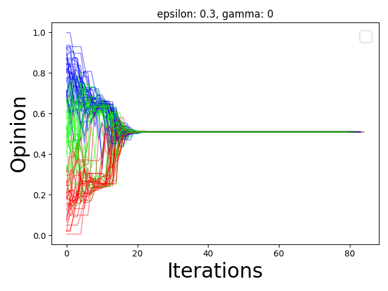
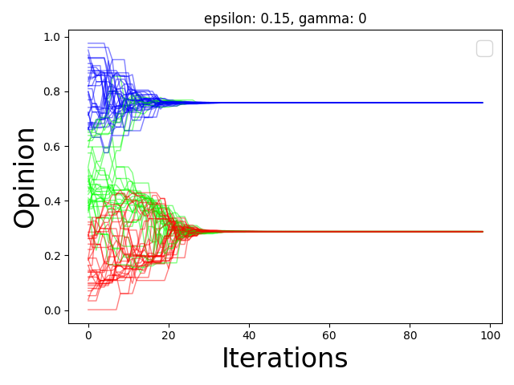
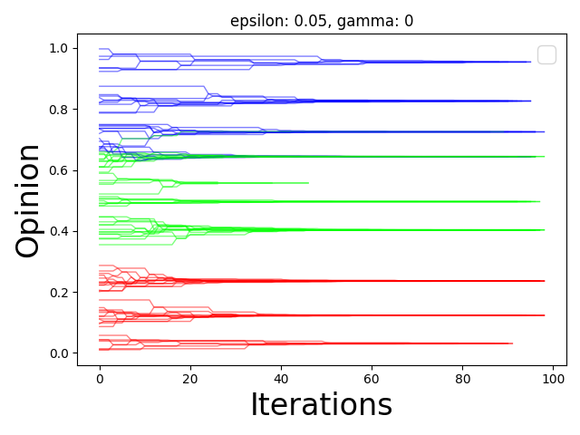
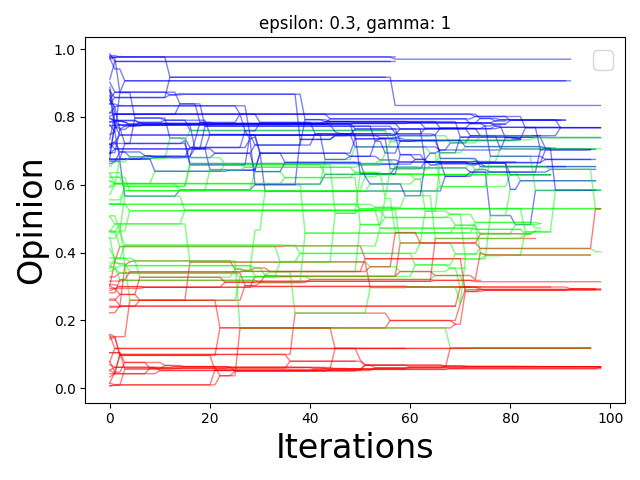

```{r setup, include=FALSE}
knitr::opts_chunk$set(echo = TRUE)
```

## Introduction

Observing, analyzing and modeling social interactions constitutes a
substantial area of research in social sciences. The concept of social
network provides a robust and handy, graph-theory-based framework for
analyzing how people interact, communicate and form communities.

One special form of interaction that falls within the scope of this
framework is social learning - an umbrella term for encompassing a
variety of phenomenons including:

-   how groups of people form networks
-   how they influence each other in such networks
-   how their opinion relates to some objective truth
-   how those opinions evolve in the process of interactions.

Many mathematical models have been developed to formalize those issues.
Usually, every such model comprises of some social **structure** defining
how agents interact and an **updating rule** which determines how each
agent forms his own opinion, possibly by taking into account opinions of
others. Sometimes those two elements are closely tied together and are
difficult to distinguish but in general we may divide those models with
respect to the latter component into two following categories.

1. **Bayesian learning models**

The underlying assumption is agents update their believes using Bayes'
rule. Formally, given a parameter $\Theta$ (e.g. an opinion about a
political issue) and a signal $s$ (e.g. a news or opinion of others),
the updating procedure is given by
\begin{equation} 
P(\Theta|s) = \frac{P(s|\Theta)P(\Theta)}{P(s)}  ,
\end{equation} where $P(\Theta)$
is a prior probability which may be interpreted as a result of agents
own observations of the world. 

2. **Non-bayesian learning models**

This class of models usually incorporate a relatively more simple updating rule.
The most prominent example is the __DeGroot model__  ^[DE GROOT M H (1974) Reaching a consensus. J. Amer. Statist. Assoc. 69. pp. 118 – 121.], sometimes known as
naive learning, which assumes that each agent updates her beliefs by taking an 
average of her neighbor's opinions (possibly, but not necessarily including her own opinion). Contrary to the Bayesian framework which might impose great cognitive abilities 
on agents which may be unrealistic to bear by real people, the DeGroot model 
provides a rule that is empirically justifiable in its simplicity but still flexible for further extensions.

If all agents are Bayesian, and there is common knowledge of this, under mild assumptions, learning will be asymptoti-cally efficient in large networks (see Gale and Kariv (2003) and Mossel and Tamuz (2010) for a myopic learning environment and Mossel, Sly, and Tamuz (2015) for a strategic learning environment). 

However, if all agents update their guess as the majority of their neighbors’ prior guesses—as modeled by a coarse DeGroot model of learning, also known as the majority voting model (Liggett (1985))—then it is possible that a non-trivial set of agents will end up stuck making the wrong guess. In practice, it might be that there is a mix of sophisticated (Bayesian) and naive (DeGroot) learners, and that Bayesians are aware
of this and incorporate it in their calculations.

In this short survey we will concentrate on the DeGroot model and provide a brief 
discussion of its various extensions found in the literature with particular focus
on their possible usage in modeling and simulation of phenomena combining information bubbles and polarization observed during the pandemics such as the anti-vaccine movements or plandemics conspiracy theory.

We will heavily rely on two papers ^[Akylai Taalaibekova, 2018. "Opinion formation in social networks," Operations Research and Decisions, Wroclaw University of Technology, Institute of Organization and Management, vol. 2, pages 85-108.] and ^[R.Hegselmann, U. Krause, et al.: “Opinion dynamics and bounded confidence models, analysis, and simulation.” in Journal of artificial societies and social simulation, 2002] and try to assess each model in context of simulating pandemics opinion phenomena. 


## Summary of the experimental paper

## Basic model

In this section we will briefly present the basic version of the DeGroot model and introduce notation that we shall further use. 

We consider a _set of agents_ $N = {1,2, ..., n}$ who interact in discrete time $T = {1,2,...}$. At each time instant $t$ every (fixed) agent $i$ has his _opinion_ $x_i(t) \in [0,1]$ and _trust_ (weight) $w_{ij}$ towards every other agent $j \in N$. Let's denote with $x(t) = \left(x_1(t), x_2(t), ..., x_n(t)\right)$ a vector of agents' opinions or _opinion profile_ at time $t$. With such notation, each agent agent updates his opinion by averaging opinions of other agents, that is 
$$ x_i(t+1) = w_{i1}x_1(t) + w_{i2}x_2(t) + ... + w_{in}x_n(t) ,$$
where $\sum_j w_{ij} = 1$


In the most general form trust may depend both on time and the opinion profile. However, whenever it does not lead to confusion we will simply write $w_{ij}$ instead of $w_{ij}(t,x(t))$ to denote agents $i$ trust towards agent $j$. The trust between agents gives raise to the structure of their interactions which can be represented as a row stochastic matrix, where $W = [w_{ij}]$ which may be also viewed at an incidence matrix of a weighted directed graph. This allows us to apply elements of the sophisticated machinery of graph theory and Markov chains to analyzing social learning problems. 

In compact matrix notation our general model (GM) has the following components:

* a directed weighted graph of trust between agents: $G = (N,W)$
* an updating rule $x(t+1) = W(t,x(t))x(t) = W^tx(0)$ for $t \in T$

The main issues analyzed within this framework are _convergence_ of beliefs and _reaching consensus_. 

We say that the beliefs **converge** for a given matrix of weights $W$ whenever for every initial opinion profile $x(0) \in [0,1]^n$ the limit 
\[\lim_{t \to \infty} W^tx(0)\] exists. 

The convergence itself does not require many strong assumptions. In fact, as stated in ^[Hegselmann, U. Krause, et al.: “Opinion dynamics and bounded confidence models, analysis, and simulation.” in Journal of artificial societies and social simulation, 2002] the sufficient and necessary conditions for beliefs to converge are:

* the matrix $W$ being _strongly connected_, meaning that in graph $G$ for every node there exists a path to any other node;

* the matrix $W$ being _aperiodic_, that is the greatest common divisor of the lengths of its simple cycles is 1. A _simple cycle_ is such that the only node which appears twice in it is the starting (ending) one.

The question alone whether or not the convergence holds is not the most exciting one however. We are more interested in structure of the limit vector which we may use to interpret the effect of interactions in the pandemic context.

One special form of the limit vector is one with all entries equal, that is a vector for which $ x(\infty)_i = c $ for all $i$ and for some constant $c \in [1,2]$. We will call it a **consensus**, and interpret as an agreement between agents that they reach after some (relatively big) period of time.

In the following sections we will present different versions and extensions of the general model along with some theoretical results and consider their usefulness in simulating opinion dynamics in pandemic context. 

```{r packages, include=FALSE}
requiredPackages = c("markovchain", "readr","diagram", "wesanderson", "expm","reticulate") # list of required packages
for(i in requiredPackages){if(!require(i,character.only = TRUE)) install.packages(i)}
for(i in requiredPackages){if(!require(i,character.only = TRUE)) library(i,character.only = TRUE) } 
source('util_funcs.R')

# Base on:
# 1. Taalaibekova, 2018 example 2.1
# 2. Janpu Hou https://rpubs.com/JanpuHou/326048

# The notation is based on Taalaibekova


# Simulation of the process
# Different type of notation of transaction matrix 
markov_chains_2 <-  function(M, x0, iter ){
  sym <- matrix(0, nrow = nrow(M), ncol =  iter )
  M_to_p_i <- M
  sym[,1] <- x0
    for(i in 2:iter) {
    
    sym[,i] <- M_to_p_i %*% x0 
    M_to_p_i <- M %*% M_to_p_i
  }
  return(sym)
}
```

```{r matrices, include=FALSE}

make_matrix <- function(dim,vals){
  M = matrix(vals,nrow = dim, byrow = TRUE)
  return(M)
}

trustAA = 3/4
trustAB = 0
trustAC = 1/4

trustBB = 3/4
trustBA = 0
trustBC = 2/8

trustCC = 0
trustCA = 1/5
trustCB = 4/5

percA = 0.4
percB = 0.5
percC = 0.1

N = 10

AA = make_matrix(N*percA,c(rep(trustAA/(N*percA),(N*percA)^2)))
AB = make_matrix(N*percA,c(rep(trustAB/(N*percB),(N*percB)*(N*percA))))
AC = make_matrix(N*percA,c(rep(trustAC/(N*percC),(N*percC)*(N*percA))))

rowA = cbind(AA,AB,AC)

BA = make_matrix(N*percB,c(rep(trustBA/(N*percA),(N*percB)*(N*percA))))
BB = make_matrix(N*percB,c(rep(trustBB/(N*percB),(N*percB)*(N*percB))))
BC = make_matrix(N*percB,c(rep(trustBC/(N*percC),(N*percB)*(N*percC))))

rowB = cbind(BA,BB,BC)

CA = make_matrix(N*percC,c(rep(trustCA/(N*percA),(N*percC)*(N*percA))))
CB = make_matrix(N*percC,c(rep(trustCB/(N*percB),(N*percC)*(N*percB))))
CC = make_matrix(N*percC,c(rep(trustCC/(N*percC),(N*percC)*(N*percC))))

rowC = cbind(CA,CB,CC)

W= rbind(rowA,rowB,rowC)

```


## Time-varying weight on one’s own beliefs
### DeMarzo et al.
One class of extensions introduces time dependent component which accounts for changes in trust that agents have in themselves. One may think of it as agents gaining (or loosing) confidence in their own opinions as the time passes. 

One of the variants by ^[DEMARZO P.M., V AYANOS D., Z WIEBEL J., Persuasion bias, social influence, and unidimensional opinions, Quart. J. Econ., 2003, 118 (3), 909–968.] assumes the following form of opinion update:
$x(t+1) = \big((1-\lambda_t)I + \lambda_tW\big)x(t),$
where $\lambda_t \in [0,1]$ for every $t$ and $I$ is an identity matrix. In fact, we may treat the lambda parameter as a function $\lambda_t : T \to [0,1]$.

With such setting we see that at given $t$ the smaller the parameter $\lambda_t$ the less willingly the agents update their opinion in current step.

Further experimentation may be focused on different forms of the $\lambda_t$ function or introducing some heterogeneity in how lambdas change for different agents.

In general the model seems suitable for modeling some aspects of pandemic situation. For instance, the decreasing function $\lambda_t$ may be interpreted as growing stubbornness of agents who decide to stick to their opinions instead of interacting.

### Examples of simulations  {.tabset}

#### Graph used

```{r}
W
show_graph(W)
```


#### Decreasing lambda

$$\lambda_t = 1 - \frac{1}{20}t$$

```{r demarzo simulation, echo=FALSE, warning=FALSE}

update_rule_1<-  function(x, W, i,lambda,iter){
  #lambda takes form of time -> scalar mapping
  
  n <- nrow(W)

  M_next <- W 

  x_next <- ((1-lambda(i,iter))*diag(n) + lambda(i,iter)*W)%*%x
  
  return(list('x_next' = x_next, 'matrix' = M_next))
}

fA_conn = function(i,t=16){ return(1- 1/t*i +runif(1,-0.01,0.01)) }
fB_conn = function(i,t=16){ return(0 + 1/t *i + runif(1,-0.01,0.01)) }
fC_conn = function(i,t=16){ return(runif(1,-0.9,0.9) ) }

lambda <- fA_conn

distA = rbeta(N*percA,1,7)
distB = rbeta(N*percB,7,1)
distC = rbeta(N*percC,7,7)

X_0 <- c(distA,distB,distC)
t <- 20 # Iteration of interactions 

ag_names <- c(rep("Agent A",N*percA),rep("Agent B",N*percB),rep("Agent C",N*percC))

sym <-simulate(W,X_0,t,update_rule_1, ag_names,lambda,t)
make_opinon_plot(sym)

```

#### Increasing lambda

$$\lambda_t = \frac{1}{20}t$$

```{r, echo=FALSE, warning=FALSE}
lambda <- fB_conn
sym <-simulate(W,X_0,t,update_rule_1, ag_names,lambda,t)
make_opinon_plot(sym)
```


### Friedkin&Johnsen ^[FRIEDKIN N.E., JOHNSEN E.C., Social influence networks and opinion change, Adv. Group Proc., 1999,16, 1–29.]

In this variant agents' willingness to update opinions are regulated by a diagonal matrix $D$ with entries from the interval $(0,1)$ that is

$$x(t+1) = DWx(t) + (I-D)x(0).$$
The main difference is that at each step agent weights his own _initial_ opinion and opinions of others. Therefore, the opinions are formed partly endogenously by the interactions and partly exogenously by the initial opinions. The balance between the mentioned exogenous and endogenous formation for each agent is encoded by entries of $D$. Those entries may be thought of as agents' susceptibilities to interpersonal influence, with 1 meaning total susceptibility and 0 meaning none.

In terms of simulations this model is more difficult to handle. Even a small change in one of the entries of the $D$ matrix results in different outcomes. On the other hand, it's easy to produce convergence without consensus which may be desired in modeling information bubbles.


```{r friedkin_johnsen, include=FALSE}

update_rule_2<-  function(x, W, i,D,x_0){
  #lambda takes form of time -> scalar mapping
  
  n <- nrow(W)

  M_next <- W

  x_next <- D%*%W%*%x + (diag(n)-D)%*%x_0
  
  return(list('x_next' = x_next, 'matrix' = M_next))
}

W <- matrix(c(0,0.2,0.3,0.4,0.1,
              0.6,0,0.1,0.15,0.15,
              0.3,0.3,0,0.3,0.1,
              0.4,0.15,0.1,0,0.35,
              0.1,0.25,0.2,0.45,0),nrow=5,byrow = T)


```

### Examples of simulations  {.tabset}

#### Graph used

```{r}
W
show_graph(W)

```

#### Special case with identity matrix

With $D = I$ the model reduces to DeGroots basic model.

```{r echo=TRUE, message=FALSE, warning=FALSE}
D = diag(5)
X_0<-c(0.4675,0.2667,0.676,0.727,0.1255)
x_0<-X_0
ag_names<-c('A','B','C','D','E')
sym <-simulate(W,X_0,10,update_rule_2, ag_names,D,x_0)
D
make_opinon_plot(sym)
```

#### High but not total susceptibility

```{r, echo=TRUE, message=FALSE, warning=FALSE}
#### example from paper

D<- diag(c(0.9,0.9,0.8,0.76,0.83))
D

X_0<-c(0.4675,0.2667,0.676,0.727,0.1255)
x_0<-X_0
ag_names<-c('A','B','C','D','E')
sym <-simulate(W,X_0,10,update_rule_2, ag_names,D,x_0)
make_opinon_plot(sym)
```

#### 15% decrease in  agent's susceptibility 

```{r, echo=TRUE, message=FALSE, warning=FALSE}


D<- 0.85*D

D

X_0<-c(0.4675,0.2667,0.676,0.727,0.1255)
x_0<-X_0
ag_names<-c('A','B','C','D','E')
sym <-simulate(W,X_0,10,update_rule_2, ag_names,D,x_0)
make_opinon_plot(sym)
```
## More complex extensions implemented in Python

Apart from the mentioned linear extensions of the deGroot model there are more complicated models that sin general have the same base idea as the original one but are more difficult to implement from scratch.

Luckily, there is a [Python library](https://ndlib.readthedocs.io/en/latest/reference/reference.html#opinion-dynamics) covering some of them which makes simulations feasible.

Those models rely on assumptions that agents update their opinions through interactions only with those agents that share opinions which are similar to theirs.  

## Deffuant model

In this model agents are connected by a complete social network (complete graph), and interact only in pairs at each step. The interacting pair $(i,j)$  is selected _randomly_ from the population at each time point.  After interaction,the two opinions, $x_i$ and $x_j$ may change, depending on a so called _bounded confidence parameter_ $\epsilon \in [0,1]$. This can be seen as a measure of the open-mindedness of individuals in a population. It defines a boundary behind which individuals cannot comunicate because their vews are too different. The updating process itself, is described as follows. If the distance between opinions $d_{ij} = |x_i - x_j|$ is small enough, that is $d_{ij} < \epsilon$ agents exchange views and the new opinions become $x_i(t+1) = x_i(t) + \mu(x_j(t) - x_i(t))$ and $x_j(t+1) = x_j(t) + \mu(x_i(t) - x_j(t))$, where $\mu$ is a convergence parameter which is usually equal to 0.5. If $d_{ij} >= \epsilon$ nothing happens.

Depending on $\epsilon$ the model produces a consensus or a fragmented opinion.

## Examples of simulations {.tabset}

### Epsilon = 0.3



### Epsilon = 0.15



### Epsilon = 0.05




## Algorithmic Bias Model

The library also has an implementation of extension of the Deffuant model in which the probability of choosing a partner for interaction depends on $\epsilon$ as well. Below is a fragment of documentation:

>The Algorithmic Bias model considers a population of individuals, where each individual holds a continuous opinion in the interval [0,1]. Individuals are connected by a social network, and interact pairwise at discrete time steps. The interacting pair is selected from the population at each time point in such a way that individuals that have close opinion values are selected more often, to simulate algorithmic bias. The parameter gamma controls how large this effect is. Specifically, the first individual in the interacting pair is selected randomly, while the second individual is selected based on a probability that decreases with the distance from the opinion of the first individual, i.e. directly proportional with the distance raised to the power gamma.
Note: setting gamma=0 reproduce the results for the Deffuant model.

```{python algobiasmodel, eval=FALSE, include=FALSE, python.reticulate=F}
import networkx as nx
import ndlib.models.ModelConfig as mc
import ndlib.models.opinions as op
from ndlib.viz.mpl.OpinionEvolution import OpinionEvolution
#g = nx.from_numpy_matrix(r.W)
# mMean field scenario
g = nx.complete_graph(100)

# Algorithmic Bias model
model = op.AlgorithmicBiasModel(g)
y = 1
x=0.3
# Model configuration

config = mc.Configuration()
config.add_model_parameter("epsilon", x) #base 32
config.add_model_parameter("gamma", y)
model.set_initial_status(config)

# Simulation execution
iterations = model.iteration_bunch(100)

viz = OpinionEvolution(model, iterations)
viz.plot("opinion_ev-{}_gamma{}.png".format(x,y))

```
We see that for the same number of iterations and same $\epsilon = 0.3$ the results change a lot when gamma parameter is set to 1.

<center>

</center>

## Hegselmann-Krause model
 In this variant a similar idea of opinion closeness is used, but instead of interacting with only one other agent, individuals average their opinion with a group of agents that have similar opinion.

For a given $\epsilon$ and a given agent $i$ let's denote by $\Gamma_{\epsilon}$ a set of agents who have opinion that does not differ more than by $\epsilon$ from agent $i$. Then agent's $i$ opinion in the next step becomes $$x_i(t+1)= \frac{\sum_{j \in \Gamma_{\epsilon}} x_j(t)}{\#\Gamma_{\epsilon}} $$.

The idea behind the formulation is that the opinion of agent i at time t+1, will be given by the average opinion by its, selected, \epsilon-neighbor.

One big difference is that opinions in this model come from an interval $[-1,1]$ instead of $[0,1]$

The model has been described along with excellent simulations in the paper Opinion dynamics and bounded confidence: models, analysis and simulation by Rainer Hegselmann and Ulrich Krause.

The Python package contains two very fresh extensions of the Hegselmann-Krause model:

* __Weighted Hegselmann-Krause (WHK)__ - which considers only pairwise interactions but takes into account the trust weights given in the graph

* __Attraction-Repulsion Weighted Hegselmann-Krause (ARWHK)__ - which again considers only pairwise interactions and defines two states depending on whether agents' opinions differ more or less than given $\epsilon$.
If $d_{ij} < \epsilon$ agents are _attracted_ and after interaction their opinions are closer than before, that is $d_{ij}(t+1) < d_{ij}(t)$. On the other hand, if $d_{ij} \geq \epsilon$ agents are repulsed and they end up further away from each other, that is $d_{ij}(t+1) > d_{ij}(t)$.

Both models are described in Opinion Dynamic Modeling of Fake News Perception by Cecilia Toccaceli, Letizia Milli and Giulio Rossetti.


## Summary

There is a wide variety of opinion dynamic models and the choice of one to use in simulating pandemics information phenomena should depend on answers to the following questions:

* _Do we want a simple model?_

If simplicity is desired the linear DeGroot extensions described in the first part might be the right choice as they can be easily manipulated "by hand" and allow for easy interpretations of the parameters.

* _Do we want a flexible model?_ 

The later described models although more complex and less transparent are the newest and state-of-art approaches to modeling opinion dynamics and allow to generate different scenarios within one single framework just by manipulating the parameters.

* _Do we need robust implementations?_

If so the Python package offers ready and tested models of bounded confidence along with simulation and visualization functions while the other extensions need to be implemented from scratch.

Of course, the models also differ in their inner mechanics and before deciding on the model one should double check if the model can produce results that he expects.


